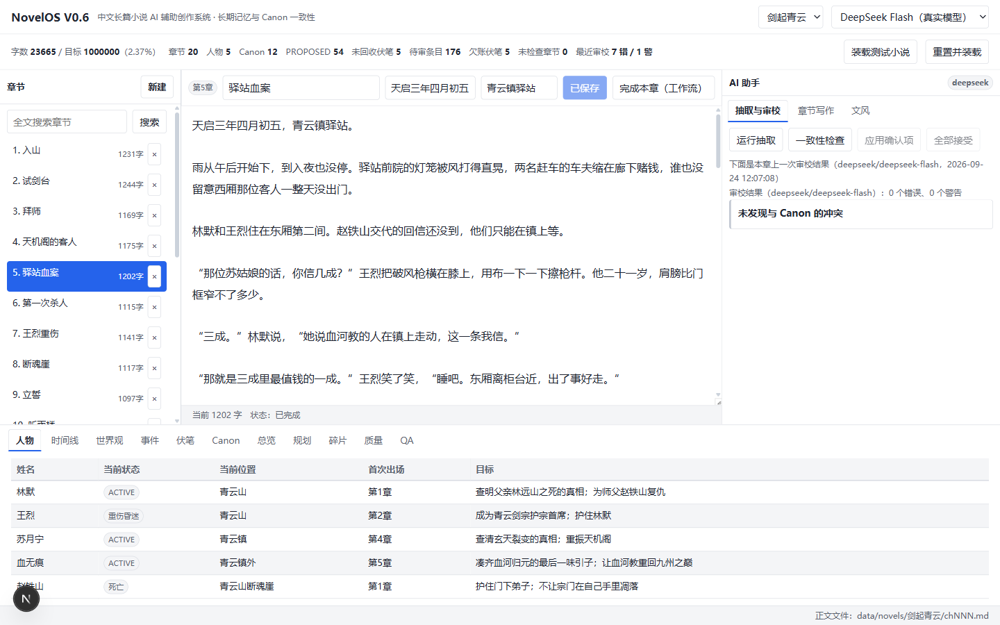
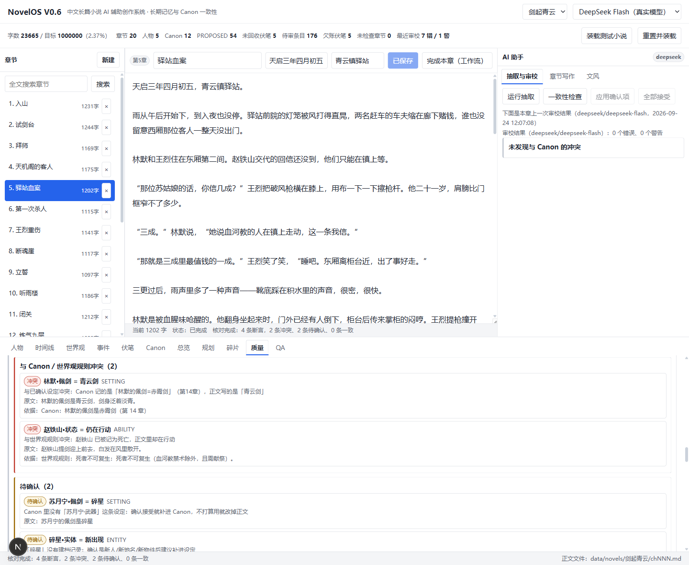

# NovelOS

一个中文长篇小说的写作台。目标是让 AI 帮你写到 100 万字，设定不打架、文字不像机器写的。

它不替你写小说。你记下想法碎片（一句话、一个画面、一段对白都行），系统检索已有设定、
把碎片展开成正文、然后逐条告诉你哪里可能有问题。所有 AI 产出都必须带证据，
所有设定改动都必须你点确认。

当前版本 0.8.0。后端 FastAPI + SQLite，前端 Next.js 15，默认模型 DeepSeek Flash（可换任意 OpenAI 兼容端点）。



## 跑起来

后端：

```powershell
cd backend
python -m venv .venv
.\.venv\Scripts\python.exe -m pip install -r requirements.txt      # 国内可以加 -i https://mirrors.aliyun.com/pypi/simple/
Copy-Item .env.example .env                                          # 要真实模型就填 DEEPSEEK_API_KEY
.\.venv\Scripts\python.exe -m uvicorn app.main:app --port 8000
```

没填密钥也能跑：会自动降级到离线规则提供者，并在界面上把这次降级当 warning 说出来。
接口文档 http://127.0.0.1:8000/docs 。

前端：

```powershell
cd frontend
npm install
npm run dev          # http://127.0.0.1:3000
```

前端只请求相对路径 `/api/*`，由 `next.config.mjs` 转发到 8000。那里的 `experimental.proxyTimeout`
设成了 600 秒，因为章节完成、修订闭环、全量扫描都是分钟级的模型调用，
用 Next 的默认值（30 秒）这些功能在浏览器里会直接失败。

装测试小说：界面上「创建小说」→「装载测试小说」，或 `POST /api/novels/{id}/seed`。

### 部署到服务器

先装 Docker（Windows 装 Docker Desktop 并启用 WSL2；Linux 装 docker engine + compose 插件），
然后在仓库根目录：

```bash
cp .env.example .env              # 填 DEEPSEEK_API_KEY；不填就走离线提供者
docker compose up -d --build
# 前端 http://<服务器IP>:3000 ，接口文档 http://<服务器IP>:8000/docs
docker compose logs -f backend     # 看日志；docker compose down 停掉（数据不受影响）
```

数据落在宿主机的 `./data`（SQLite 库 + `data/novels/<书名>/chNNN.md`），重建容器不丢。
只想先在本机看效果，同样一条命令。

镜像里两个容易踩的点已经处理好：后端第一次启动会自己在空卷里建库并跑迁移；
前端用 Next 的 standalone 产物，`/api` 转发指向容器内的后端服务名（构建时就写进产物里）。
要挂自己的 OpenAI 兼容端点（本地 Ollama、公司网关等）看根目录 `.env.example` 里的
`NOVELOS_PROVIDERS`，容器里访问宿主机要用 `host.docker.internal`。

不想用 Docker 就分别起：后端 `uvicorn app.main:app --host 0.0.0.0 --port 8000`，
前端 `npm run build && npm run start`，用 `NOVELOS_BACKEND_URL` 指到后端地址。
前端只请求相对路径 `/api/*`，所以对外只需要暴露前端那一个端口（Next 会把 `/api` 转发到后端）。

想给公网一个临时网址（演示用），隧道最方便：`cloudflared tunnel --url http://localhost:3000`，
或 `ngrok http 3000`。这条路要注意：你的小说正文会经过第三方隧道服务，
而且**没有登录的地址等于谁都能看**，正式用还是自己机器或自己的服务器上跑。

## 它做什么

入口是碎片。任何东西都可以扔进 `fragments`：半句话、一个画面、对某个人物的想法。
碎片带类型、意图、标签、相关人物、目标章号，并且同时进全文索引和向量索引。
所以写作时会自动带上相关碎片，规划时会看到还没安排的碎片，问答能召回「当初是怎么想的」。

成文得交对应表。每条碎片都要给出对应的正文片段和用到的原话，代码会双向校验：
原话必须真在碎片里、正文必须真在成文里，对不上的对应关系丢掉。
用不上的碎片必须报出来并说明原因。成文之后还会用确定性规则扫一遍，
凡是 Canon 里没有的「主语+谓语+宾语」陈述（比如「林默的佩剑是玄铁重剑」）都报给你决定。

写之前先把设定喂进去。相关人物的 Canon 事实、人物当前状态、最近事件、时间线、未回收伏笔、
世界观规则、前文摘要，加上语义检索到的前文片段。锁过文风的话还会带一段把基线翻译成硬要求的文字
（节奏、推进密度、标点、句式、别重复哪些桥段）。再加上你在「总览 → 本书设定与大纲」里写的
简介、世界观、全书大纲——规划、写作、碎片成文都带着它们，换题材、重编大纲之后写出来的东西会跟着走。
这份检索快照随生成记录入库，事后能查写作时读到了什么。

写完逐条核对，四层：声称核对（拆出设定断言跟 Canon 和世界观规则比，一致/冲突/待确认）、
文风评审（三十多项指标对比本书基线，加一层模型读感）、推进与节奏（注水段、名词解释、标点均匀、
句式循环、跨章复读）、用词与收束（同一批词打转、堆生僻字、章末总结、升华议论、过渡太顺、桥段反复）。

改稿有两道护栏。声音护栏比「声音保留分」，磨掉作者特征就回退保留原稿。
篇幅护栏是不对称的：掉到 0.6 倍以下直接拒（那是偷工，会静默丢内容），
涨到 1.2 倍以上只提醒，超过 1.8 倍才拒。中间放宽，因为把总结句改成动作和对白本来就会变长。

## 实测

对一段典型「AI 味」样段的改稿（DeepSeek）：

| 指标 | 改稿前 | 改稿后 |
| --- | --- | --- |
| 套话密度 | 58.02 | 0.00 |
| 抽象词密度 | 13.65 | 0.00 |
| 长句占比 | 0.222 | 0.000 |
| 章内自重复率 | 0.0115 | 0.0000 |
| 对白占比 | 0.000 | 0.287 |

对 0.6 版的样稿（写成「章末总结 + 升华议论」）：总结回扣句 33.98 → 5.13，升华议论 4.85 → 0.00，
用词多样性没被压塌，生僻字占比保持 0。碎片成文那次，声音保留分 76.6，3/3 条碎片全部展开。
（都是每千字的密度或比例。）

## 两条红线

**AI 写不到 CANON。** 唯一的 AI 侧写入口 `propose_canon_fact` 里把状态硬编码成 `PROPOSED`，
代码里不存在 AI 直接写 CANON 的路径。章节完成工作流的前 10 步跑完 Canon 一条都不变，
后面 5 步必须你在审校面板点「应用确认项」才执行。升级一条事实时，
同主谓的旧事实自动标 `SUPERSEDED` 并记下被谁取代。

**每条结论都要有证据。** `ContinuityIssue` 在 Pydantic 层强制要求证据非空、来源章节非空。
模型叙事通道返回的候选如果没带证据，会被丢弃并记进 `dropped_issues`，不会出现在给你看的列表里。
属性句和日期的归属由确定性规则判，所以模型漏抽也不会漏检。

## 界面

左边章节列表（能搜索跳转），中间正文编辑器，右边 AI 助手，底部 13 个面板：
人物、时间线、世界观、事件、伏笔、Canon、总览、规划、结构、读者、碎片、质量、QA。

关注这几件事：审校面板逐条列问题、证据和改法，可逐项接受/驳回；
Canon 面板按状态过滤、显示每条事实的生效章与失效章，还有「第 N 章时的世界状态」时点视图；
结构面板给全书的节奏线、连续弱区、每 5 章的节奏窗口（含张弛度判定）；
读者面板收平台后台的数据，验证我们的判定跟读者的实际表现对不对得上；
质量面板建文风基线、评草稿、跑不变量、维护承诺、设定断言核对、文风锁定、发布前检查；
总览面板放本书设定与大纲、每章健康矩阵、错误统计、伏笔欠账、向量索引与导出。
窄屏（<1100px）改成单列堆叠。

设定断言核对长这样：贴一段草稿或选一章，冲突的每一条都给出原文片段和依据（Canon 事实带章号，
世界观规则给规则原文），查无此设定的一律落在「待确认」。



## 发布

面向番茄免费小说这类按章发布的平台。检查的依据不是我自己定的阈值，而是**平台官方课程与规范**，
每条检查都能追到出处（界面上可展开看原文要点）：

| 依据 | 落成什么检查 |
| --- | --- |
| 签约标准：不接受 AI粗制滥造、格式混乱、结构失常、空洞水文；「大段内容未能推动情节发展」 | 四条低质规则映射 + 推进密度 + 注水段落 + 格式检查 |
| 低质治理公告：平台按月处置低质书籍（8 月拒签 16.3 万本、下架 6.1 万本） | 风险词（站外引流、露骨描写、血腥过度、封建迷信、赌博毒品）算**阻断项** |
| 《如何稳定剧情，让读者追更不停？》· 番茄作家课堂 | **第一页**（约 600 字）检查：不要背景介绍开场、页尾要留一句让人想翻页的话；章末留钩每章都要做，并按钩子类型（悬问/危机/揭示/反转/截断/情绪）判断 |
| 《拒绝流水账！从情节到节奏》· 番茄作家课堂 | **超过一百字的纯描写段**提醒回头看看是不是水文；节奏张弛度（一直紧读者累、一直松读者走） |
| 帮助中心福利口径 | 字数（默认按章 2000–3000）、每日更新目标 4000 / 6000 字 |

「总览」面板可以导出成 txt：去掉 Markdown 标记、章节之间留空行，直接粘贴或上传到平台后台。

## 结构视图

文本层的规则压得住「文面」问题，但平台点名的「结构失常」和读者会在哪一段掉队，
只能跨章连起来看。「结构」面板把全书排成一条线：

- 节奏线：每章一格，按达标／偏弱／有硬伤三档着色。
- 逐章表：钩子分、推进密度、注水比例、审校错误、断言冲突，以及结构事件（伏笔首现/推进、承诺到期）。
- 连续弱区：单章弱可以忍，连着弱是读者会走的地方。
- 节奏窗口（每 5 章一段）：两个判据 —— 绝对值低于下限，或比全书平均低 15% 以上；
  另加张弛度判定（一直紧/一直松）。

## 读者数据回环

阈值是我按经验定的，所以留了一个「读者」面板：把平台后台的章节数据（阅读人数、完读率、追读率、
收益、评论数）直接粘进去，制表符、逗号、多空格都能分列，`23.5%` 与 `0.235` 都认。
之后它会并排给出三件事：

- **判定有没有效**：我们报警的弱章，完读率是否真的低于其余章（差多少个百分点）。
- **我们漏了什么**：没报警但完读率明显低于全书平均的章 —— 这比误报重要，说明指标抓错了东西。
- **读者在哪掉的**：阅读人数相对上一章下降最多的章。

再加一条全书结论与校准建议（误报比漏报多就说明阈值偏严，反之说明我们没抓到读者在意的东西）。
每章的期望字数与每日更新目标也在「总览 → 本书设定」里可改，不用等改代码。
作者也可以放一份 `data/risk_words.json` 自己补审核风险词。

## 测试

```powershell
cd backend
.\.venv\Scripts\python.exe -m pytest                    # 285 passed（跳过的是需要真实模型的用例）
$env:RUN_LIVE="1"; .\.venv\Scripts\python.exe -m pytest tests\test_live_deepseek.py   # 19 个真实模型用例
```

CI 跑的就是这套离线用例（`.github/workflows/tests.yml`，不需要密钥，离线提供者兜底）。

种子小说《剑起青云》20 章里埋了 3 处矛盾：第 14 章换了佩剑（该报事实冲突）、
第 15 章已死的赵铁山现身出手（该报死者复现）、第 18 章的血案日期与 Canon 差一个月（该报时间倒置）。
第 9 章和开篇的日期句是对照项，用来确认不会误报。

每条需求对应哪个机制、由哪个用例守着，列在 [docs/requirements-to-tests.md](docs/requirements-to-tests.md)。

## 已知边界

- 模型输出达到 `max_tokens` 时会显式报「输出被截断」，但截断本身还是会发生，遇到就缩小范围重试。
- 用词那几个指标是近似量：用词多样性用汉字二元组在 200 字窗口里算类符/形符比，
  衡量的是「同一批词反复用」，不是语言学上的词汇量；桥段同质化靠固定短语表，表外的套路识别不到。
- 断言核对有两条通道，各有各的漏。确定性通道只认显式句式（「X 的佩剑是 Y」），指代词解析不了；
  模型通道会拆这类自由表述，但判定在 Python 里做，它没拆到的矛盾也报不出来。
  查无此设定一律标「待确认」，不会替你写进 Canon。
- 冲突判定偏保守。两个取值如果不像短实体名（长句、带引号），冲突会降级成「请人工确认」，
  宁可少报一条假冲突。
- 世界观规则只有四类做了结构化判定（死者复生、唯一持有、能力门槛、不可变特质），
  其余自由文本规则只能靠「相关且极性相反」的近似判断，会漏。
- 文风锁定收的是比对窗口（容差乘 0.5），不会让模型换风格。旧版本建的基线缺新指标时会提示重建。
- 本地向量是 n-gram 哈希，能容忍说法差异，但不是训练出来的语义模型；
  要真正的语义召回把 `NOVELOS_EMBEDDING_PROVIDER` 换成远程 embedding，业务代码不用改。
- 离线提供者是确定性规则引擎，只覆盖正文里显式写出的设定；真实抽取质量来自 DeepSeek Flash。
- 全量扫描的 `rules` 模式不调模型，看不到语义级矛盾；`full` 模式逐章调，20 章要几分钟并产生费用。
- 人物状态冲突只认「死亡 / 重伤昏迷 / 失踪 / 闭关 / 被囚 / 封印」这类无法行动的状态，
  更细的（比如「隐姓埋名」）得靠你补人物档案。
